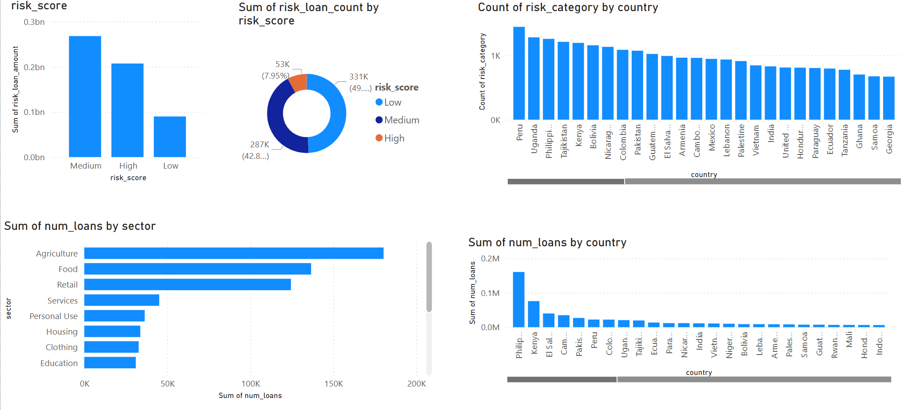

<h1 align="center">
    <strong>Kiva Crowdfunding Pipeline ELT Project - Databricks Madallion Architecture</strong>
</h1>

  

## Overview
This project implements an end-to-end ELT (Extract, Load, Transform) pipeline using the Medallion Architecture (Bronze → Silver → Gold) on Databricks for Kiva.org’s crowdfunding dataset. The pipeline processes raw CSV data files stored in Azure Data Lake Gen2 and delivers clean, enriched analytical datasets for Power BI dashboards.

  

https://www.kiva.org/

Kiva’s dataset contains detailed records of microloan transactions facilitated through the Kiva platform, including loan details, lender information, borrower profiles, repayment status, and geographical data. The data covers various attributes such as loan amounts, funding dates, sector categories (e.g., agriculture, retail), borrower demographics (gender, country, region), and loan performance metrics.

By structuring the data into the Bronze, Silver, and Gold layers:

- **Bronze Layer** ingests raw, unprocessed CSV files capturing the full granularity of each loan event.
- **Silver Layer** refines the data by cleaning inconsistencies, handling missing values, and standardizing fields like dates and categorical variables.
- **Gold Layer** aggregates and enriches the data, producing business-friendly tables optimized for analytical queries and dashboard visualizations, such as total funded amounts by country, repayment rates over time, and lender activity summaries.

This architecture ensures data quality, enables incremental updates, and supports scalable analytics to help stakeholders better understand the impact and trends in global microfinancing via Kiva.

# Architecture

## Tools & Technologies
- **Docker/Postgre:** First storage of the data 
- **Azure Data Lake Storage Gen2:** Central storage for raw and processed data  
- **Databricks:** Orchestration and transformation layer with notebooks  
- **Azure Data Factory (ADF):** Pipeline orchestration and scheduling  
- **Power BI:** Visualization and reporting  

## Pipeline Flow

### 1. Data Ingestion (Bronze Layer)
- As a first step local csv data was loaded Postgre database on Docker to serve as a source database.
- Azure storage account created
- Azure bronze container created by Terraform
- Storage account key generated for Azure Data Lake Gen2
- Data examined and loaded by 1-Upload-Kiva_Data_postgre.ipynb code.

After the orchestration part bronze layer has some changes
- Raw CSV files are uploaded directly to an ADLS Gen2 container (`/code/`).
- A Databricks notebook (`csv_to_bronze`) is triggered via ADF to:
  - Load the CSV incrementally based on a date field (e.g., `funded_time`)
  - Partition the data by year and month
  - Write it as Parquet files to the Bronze path

### 2. Data Transformation (Silver Layer)

- Another Databricks notebook (`bronze_to_silver`) processes Bronze data:
  - Cleans and validates fields
  - Critical nulls are deleted
  - Non-critical nulls are filled -1
  - Outputs structured and clean data to the Silver path

### 3. Aggregation & Output (Gold Layer)

- A third Databricks notebook (`silver_to_gold`) performs:
  - Business-level aggregations (e.g., total loan amount by country/sector)
  - Prepares data models for Power BI
  - Writes final datasets to the Gold path

### 4. Orchestration with Azure Data Factory

- ADF pipeline automates the full pipeline:
  - Triggered when new CSVs are added to ADLS
  - Executes all three Databricks notebooks in sequence
  - Ensures fully incremental and automated processing without PostgreSQL dependency
  - Here, to provide the orchestration and building incremantal ingestion in the bronze layer, placed the csv file in the "code" container in Azure Data Lake Gen2 storage and performed the ingest from there. (5-csv_to_Bronze Incremental.jpnyb)
  - All processes of the medallion architecture were automated
  - Pipeline was schedued every friday at 08:00am

  

### Incremental Loading Strategy

- The `csv_to_bronze` notebook uses an incremental key (`funded_time`) to detect and load only new records.
- Existing data in the Bronze layer is compared with incoming data based on the max value of this key.
- This avoids duplicate ingestion and supports seamless append-only data growth.

## Monitoring and Logging

- Output logs and row counts are printed in Databricks notebooks.
- ADF provides success/failure monitoring of the overall pipeline.

## Power BI Integration

- Power BI connects directly to the Gold layer via ADLS Parquet connector.
- Dataset refreshes automatically pick up new data written to Gold.
- Reports are updated without requiring schema changes.

  

  

## Future Developments

The current ELT pipeline automates data ingestion, transformation, and loading up to the Gold layer using Azure Data Lake Gen2, Azure Data Factory (ADF), and Databricks. To further enhance the project, the following future improvements are planned:

- **Data Quality Validation**:  
  Integrate tools like [Great Expectations](https://greatexpectations.io/) or [Apache Deequ](https://github.com/awslabs/deequ) at the Silver layer to enforce schema, null checks, and value constraints.

- **Parameterization & Config Management**:  
  Introduce configuration-driven pipelines using JSON/YAML or Azure Key Vault for managing environment variables, file paths, and incremental keys.

- **Delta Lake Integration**:  
  Replace Parquet outputs with Delta Lake tables for optimized performance, ACID transactions, and time travel capabilities.

- **Data Lineage & Monitoring**:  
  Implement Azure Purview or Unity Catalog (Databricks) for data lineage, discovery, and governance. Include monitoring and alerting for failed ADF runs or data anomalies.

- **Automated Testing**:  
  Add unit and integration tests for notebooks and pipeline logic using tools like `pytest`, `unittest`, or `dbx` for Databricks.

- **Streaming Support**:  
  Extend the pipeline to support real-time data ingestion using Azure Event Hub or Kafka and Structured Streaming in Databricks.

- **CI/CD for DataOps**:  
  Adopt DevOps best practices using GitHub Actions or Azure DevOps for version control, continuous integration, and deployment of notebooks and ADF pipelines.

## License
This project is licensed under the MIT License - see the (LICENSE) file for details.